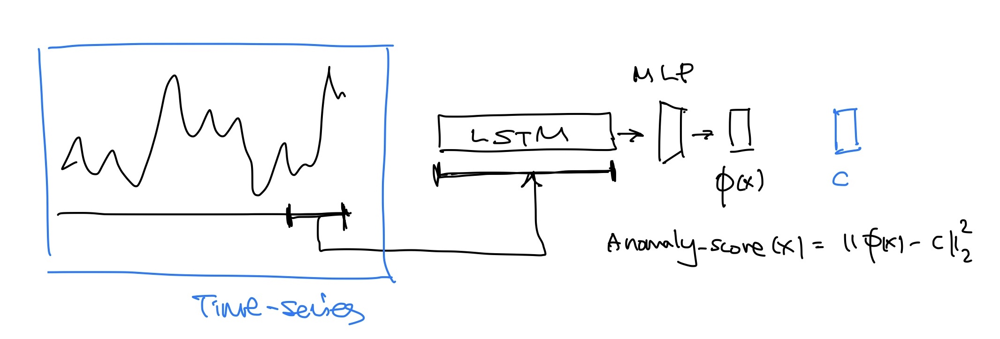

# DeepSVDD for Time-series Anomaly Detection

## Overview



## Usage
```bash
conda env create -f conda_env.yaml
conda activate essanomaly
```


## config
- data
  - path : 데이터셋 경로
  - name : panli / sionyu
  - dim : 5 (V, I, SOC, T, Vgap)

- model:
  - path : 모델 체크포인트 경로
  - window_size : 모델에 들어가는 window 크기
  - step : window를 옮기는 크기
  - hyperparameters..

- train:
  - epochs


## TODO
- F1 metric for test data
- Validation